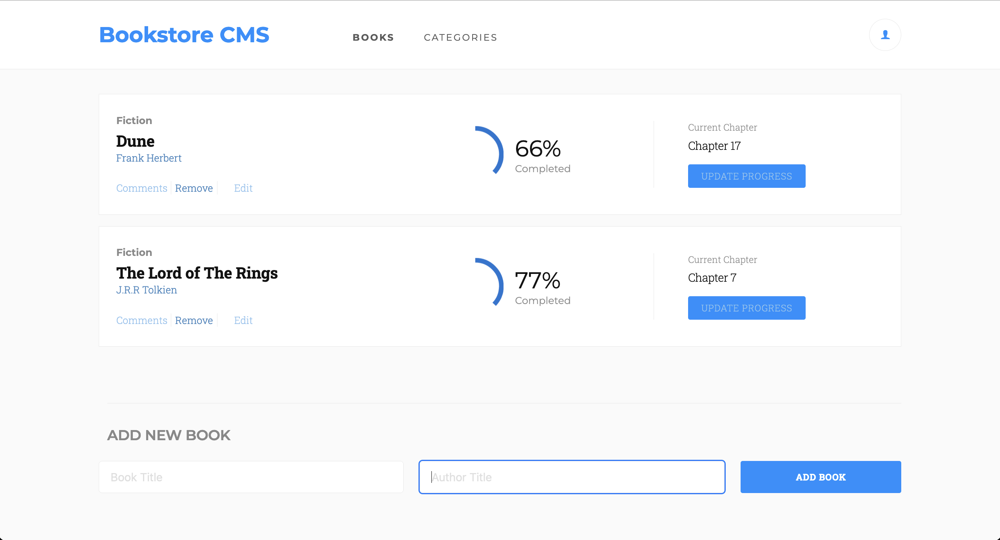

  

# Bookstore 📚
> Bookstore is a web based app to keep track of your reading habits.

## Static Deploy
- [Github Pages](https://raminka13.github.io/bookstore)

## Tech ⌘⇧
- **HTML & CSS best practices:** Correct use of tags, elements, properties and syntax.
- **GitHub flow:**  Correct use of Branches for deployment and features development.
- **Webpack:**  Source development for production bundling.
- **Linters Check:** Local and Pull Request Github workflows to check for stylistic errors, bugs and syntax errors in code.
- **React:** Build on `React.js` framework with jsx.

## Clone Repository
- Copy this code on your CLI to clone the repository `$ git clone https://github.com/raminka13/bookstore.git`
- `cd bookstore`
- run `npm install` to install all the dependencies.
- run `npm start` to open the app in your localServer.

## Author ✍🏼
👤 **Raul A Ospina** 🧑🏻‍💻
- GitHub: [@raminka13](https://github.com/raminka13)
- Twitter: [@raminka13](https://twitter.com/raminka13)
- LinkedIn: [Raul Ospina](http://linkedin.com/in/raul-ospina-83232614)

## Project Milestones
- **Milestone 1** Initialize project with components (React only). ✅
- **Milestone 2** Add reducers and actions. ✅
- **Milestone 3** Use Redux in React components. ✅
- **Milestone 4** Connect to API. ✅
- **Milestone 5** Styling. ✅

## 🤝 Contributing
> Contributions, issues, and feature requests are welcome!
Feel free to check the [issues page](https://github.com/raminka13/math-magicians/issues).

## Show your support 🦾
- Give a ⭐️ if you like this project!

## License 📝 
- This project is [MIT](LICENSE) licensed.
